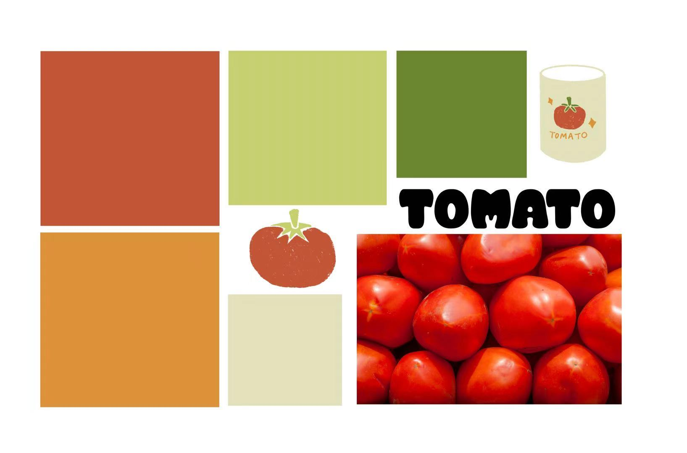

| [home page](https://vivianma0107.github.io/vivian-ma-portfolio/) | [data viz examples](dataviz-examples) | [critique by design](critique-by-design) | [final project I](final-project-part-one) | [final project II](final-project-part-two) | [final project III](final-project-part-three) |

# Wireframes / Storyboards
[Link to Shorthand](https://preview.shorthand.com/9Xa2dqQw8LRZengJ)

# User Research 

## Target Audience
Because the tomato is a ubiquitous food staple, I structured this project for a broad audience rather than a niche group of people. Yet, I believe the following readers will find the story most engaging:

* **Consumers of Tomato Products:** They can follow the full journey of a vegetable they enjoy, from production and global trade to final consumption, by tracing the tomato's supply chain.
* **Agriculture & Horticulture Enthusiasts:** They can deepen their knowledge of the global production and trade scale of tomatoes, with a focus on the United States market.
* **The Generally Curious Reader:** This project can offer a new perspective on an everyday item, providing interesting facts and context often overlooked.

## Interview Script

| Goal | Questions to Ask |
|------|------------------|
|  **Audience and engagement:** Determine if the project resonates with its intended audience and encourages further exploration.|Who do you think is the intended audience of this project? What elements on this website make you want to click or explore the story further?|
|**Clarity and comprehension:** Assess whether the visualizations are self-explanatory without relying heavily on accompanying text.|Can you clearly understand the main point of each visualization (the graphs themselves) without any contextual information?|
|**Design:** Assess the effectiveness and appeal of the stylistic choices.|What do you think are the strongest visual elements of the data visualizations, and conversely, what design elements hindered your understanding or enjoyment of the graph?|
|**Storytelling and structure:** Evaluate the project’s overall flow and completeness as a narrative.|Do you feel there are any missing topics or gaps in the narrative regarding the life of a tomato?|

## Interview Findings
Interview 1 - classmate (MAM program, 20s)

Interview 2 - classmate (MEIM program, 20s)

Interview 3 - A foodie and home cook friend who pays attention to ingredients (20s)

Interview 4 - A general audience who likes to cook (50s)

| Questions               | Interview 1 | Interview 2 | Interview 3 | Interview 4 |
|-------------------------|--------------------------------|-------------|-------------|-------------|
| Who do you think is the intended audience of this project? What elements on this website make you want to click or explore the story further?| The layout of the Shorthand webpage is cute and engaging. | The title page image captures people’s attention. | People who care about their food sources, the culinary experience, and the environmental impact (carbon footprint). Content on Shorthand is too dense to be engaging. Needs more conciseness, larger fonts, and interactivity. | Students and people from the agricultural/ food industry. It’s not a concern to have too many words on the webpage; images are more important when attracting audiences. |
| Can you clearly understand the main point of each visualization (the graphs themselves) without any contextual information? | For the world production map, if the data trend remains relatively static across the observed years, consider transitioning the visualization to a single-year static map instead of a temporal animation. | Add specific data values and axis labels to the graph that shows typical vegetable groceries. | Data visualizations are generally clear and understandable. Might consider revising the color scheme on the world production map so the color contrast is more conspicuous. | The data visualizations are fairly easy to understand. |
| What do you think are the strongest visual elements of the data visualizations, and conversely, what design elements hindered your understanding or enjoyment of the graph? | Timeline to tell the story rather than scrolling through the website. | No major concerns with designing elements of the data visualizations. | No major concerns, but the project needs attention to the amount of text and the narrative transitions between text blocks and graphics. | The graphs are well-designed in terms of simplicity. |
| Do you feel there are any missing topics or gaps in the narrative regarding the life of a tomato? | Can add some relevant statistics showing how many people like tomatoes to make the narrative more engaging. | Consider concluding the story with a call to Action, such as encouraging readers to buy locally sourced tomatoes. | Can provide more context for the data visualizations, especially the two anecdote graphics, so they flow well with the story. | No, the story is coherent. |

# Identified Changes for Part III

| Research synthesis                       | Anticipated changes for Part III                                                |
|------------------------------------------|---------------------------------------------------------------------------------|
| Reduce text density and add more interactive elements to make the webpage more compelling to scroll through. | (1) Use a larger font size. (2) Play with the template provided on Shorthand to see if there is any way stories can be told in a more interactive way (for example, using the timeline template to narrate the journey of tomatoes). |
| Improve the narrative transition between text and data visualizations. | Look through the existing data visualizations to see if the graph is accompanied by sufficient context and explanations so the story flows smoothly and intentionally from one point to the next. |
| Improve clarity on the data visualizations. | (1) Change the color scheme of the world production map. (2) Add numbers and axis labels to the typical grocery graph.|
| Add a final call to action to strengthen the project’s reach and impact. | I will start by analyzing all the visualizations, documenting the findings, and then deriving a call to action from those results. For now, a section will be created as a placeholder for the call to action. |

# Moodboard

## References
No additional reference at this point, but will include more in the Shorthand webpage.

## AI Acknowledgements
I used Gemini to help me brainstorm interview question prompts based on the project goals I determined for myself, and I used Grammarly to correct the grammar and spelling for this write-up.

